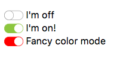

# Toggle Button

> Pimp your checkbox! 



CSS only, no dependencies, works down to IE10, yeah!
Always reflects the state of the checkbox.

## Usage

Include the contents of `toggle-button.css`.

Use it in your forms, make sure the `<span>` follows the `<input>`:

```html
<label for="cb-1">
	<input type="checkbox" id="cb-1" class="toggle-button-trigger" checked>
	<span class="toggle-button"></span>
	I'm on
</label>
```

## Custom Colors

The color of every part is customizable, just assign an additional class to the checkbox:

```html
<label for="cb-2">
	<input type="checkbox" id="cb-2" class="toggle-button-trigger">
	<span class="toggle-button toggle-button--error"></span>
	Fancy colors
</label>
```

and the CSS:

```css
.toggle-button-trigger:checked + .toggle-button--error {
	background-color: #c1272d;
	border-color: #c1272d;
}
.toggle-button-trigger:checked + .toggle-button--error:before {
	border-color: #c1272d;
}
```


## TODO:

- [ ] Compatibility tests
- [ ] Provide SASS version
- [ ] Accessibility


Kudos to [Sara Soueidan](http://tympanus.net/codrops/2015/07/16/styling-svg-use-content-css/) for the detailed article, thanks!